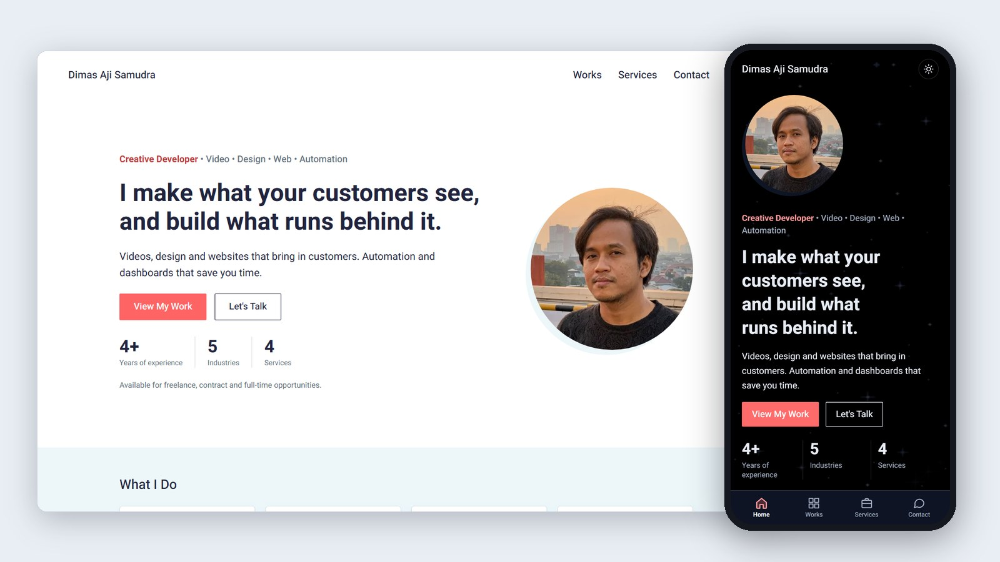

# Dimas Aji Samudra — Portfolio

Source code of my portfolio website. I'm a creative developer: I make videos, design and websites that bring in customers, and build the automation and dashboards that run behind them.

**Live site:** [dimas-aji-samudra.pages.dev](https://dimas-aji-samudra.pages.dev)



## What's inside

- **Case studies with evidence.** Dashboard screenshots with client details redacted, numbered exhibit markers, video reels and a zoomable lightbox.
- **Light and dark theme.** It follows the device setting, and a choice made with the toggle is remembered.
- **Built for phones.** Phones get a bottom tab bar for navigation and layouts checked at 390 px wide.
- **Fast by default.** Pages are static HTML with no client-side framework. The only JavaScript is a few small inline scripts. Images are served responsive in WebP/JPG, videos load only when played, and the font is self-hosted.
- **Accessible.** The markup is semantic, focus styles are visible, reduced motion is respected, and colour contrast is checked with axe-core.
- **Search-ready.** Every page has a canonical URL and an Open Graph preview image. The site includes a sitemap, `robots.txt` and 301 redirects from old URLs.
- **No backend to maintain.** The contact form sends through FormSubmit. If a message can't be sent there, it falls back to the visitor's email app.

## Tech stack

| Area | Tools |
| --- | --- |
| Site | [Astro 7](https://astro.build), TypeScript, plain CSS with design tokens |
| Images | `astro:assets` + sharp (responsive sizes, WebP) |
| Hosting | Cloudflare Pages (static hosting, headers and redirects), deployed from this repo |
| Contact form | FormSubmit, with an email-app fallback |
| Media scripts | Python, Pillow, ffmpeg |

## Project structure

```text
src/
├─ pages/         Routes: home, works, services, contact, case studies
├─ layouts/       Base page layout and case-study layout
├─ components/    Header, cards, exhibits, video reel, lightbox, …
├─ data/          Site info, projects, services and design cases (edit content here)
├─ styles/        Design tokens and global styles
└─ assets/        Optimised images and videos
public/           Static files, _headers and _redirects
source-files/
└─ scripts/       Media pipeline: redaction, video compression, profile and preview images
docs/             Screenshots and the working guide (Indonesian)
```

## Run it locally

Requires Node.js 22.12 or newer.

```bash
npm install
npm run dev       # dev server at http://localhost:4321
npm run check     # type and template checks
npm run build     # static site in dist/
npm run preview   # serve the built site
```

## Deploy

Every push to `main` is built and published by Cloudflare Pages (build command `npm run build`, output folder `dist`). The Node.js version comes from `.node-version`.

## Privacy

Client names, staff names, logos and location data in the case-study screenshots are redacted before publishing (`source-files/scripts/prepare-evidence.py`). Original, unredacted files are kept out of this repository.

## License

© 2026 Dimas Aji Samudra. All rights reserved.
The code is public for reference. The images, videos and client work shown on the site may not be reused without permission.

## Contact

[Contact page](https://dimas-aji-samudra.pages.dev/contact/) · [LinkedIn](https://www.linkedin.com/in/m-dimas-aji-samudra-1143a223b/) · [Behance](https://www.behance.net/dimc4)

Working notes in Indonesian: [docs/PANDUAN.md](docs/PANDUAN.md)
